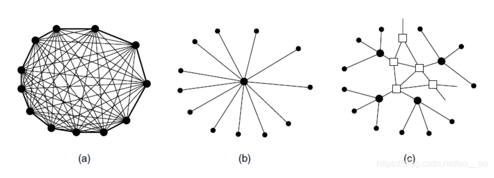

# Physical Layer
## 理论基础
### 傅里叶分析
数字信号 -> 模拟信号
$g(t) = \frac{1}{2}c + \sum^{\infin}_{n=1}a_nsin(2\pi nft) + \sum^{\infin}_{n=1}b_ncos(2\pi nft)$
### Bandwidth-limited signals
#### 调制解调
- 调制encode: 把数字信号转换为模拟信号
- 解调decode: 把模拟信号转换为数字信号
#### 波特率
每秒钟传送波形的数量/波特率表示单位时间内传送的码元符号的个数
#### 码元
在使用时间域(时域)的波形表示数字信号时，代表不同离散数值的基本波形
#### 比特率
每秒钟传送bit的数量
#### 波特率和比特率关系
[知乎波特率和比特率](https://zhuanlan.zhihu.com/p/630588317)
码元状态数量为N，就需要$log_2N$个比特位表示
比特率 = 波特率$\times log_2N$

#### 信道限制
即便信号传输很快，但是也会受到信道(传输介质)的制约，也可能发挥不了信号的性能

这里用了电话线举例，最高只能传输3000Hz
因为数据传输率bps太高的话，根据傅里叶变换，较高频率的谐波过不去，因此只有低频率的谐传输就不准确
### Maximum data rate of a channel
#### Nyquist's Theorem
无噪声情况
任意一个信号通过了一个带宽为B的低通滤波器，只要进行每秒2B次的确切采样，就可以完全重构出被过滤的信号
如果信号包含了V个离散等级
最大数据速率 = 2B $log_2V$ (BIt/sec)
#### Shannon's formula for capacity of a noisy channel
带宽为B Hz，信噪比是S/N的有噪声信道，S为信号功率，N为噪声功率
最大比特率 = B $log_2(1 + \frac{S}{N})$
## 传输介质
- 磁介质
- 双绞线
- 同轴电缆
- 电力线
- 光纤

## 无线传输
- 电磁频谱

低频段比较繁忙拥挤，因为成本比较低
高频段用于医疗、航空

- 无线电传输
- 微波传输
- 红外传输
- 光通信
频带的概念

## Communication Satellite
- Geostationary Satellites(地球同步卫星)
- Medium-Earth Orbit Satellites(中地球轨道卫星)
- Low-Earch Orbit Satellites(低地球卫星)
- Satellites Versus Fiber

同样是低频段拥挤，成本低
高频段昂贵，并且容易受到干扰(天气...)

round-trip往返旅程delay time双倍

## 数字调制和多路复用（Digital Modulation and Multiplexing）
将比特转换为联系变化的模拟信号即为数字调制

- Baseband Transmission基带传输
  - 信号传输占有传输介质上从零到最大值之间的全部频率，最大频率取决于信令速率
  - 有衔接之普遍使用
  - 
- Passband Transmission通带传输
  - 信号战屡以载波信号频率为中心的一段频带
  - 无线和光纤信道常用
  - 
- **Frequncy Division Multiplexing频分**
  - 将频谱分成几个频段，每个用户完全拥有其中一个频段来发送自己的信号
  - 
- **Time Division Multiplexing时分**
  - 用户以循环的方式轮流工作，周期性地获得整个带宽非常短的一段时间
  - 
- **Code Division Multiplexing码分**
  - 大家都在这个信道上通信，类似正交编码的方式，每个用户需要一个正交码经过一系列的数学运算提取自己要的信息

## 公共电话交换网络
两台计算机要通信，通常最容易的做法是用**一根电缆**将它们连接(局域网)。但距离很远的时候，电缆铺设的费用以及穿过公共道路并不实际，网络设计者必须依赖**已有的电信设施建设网络**
### 电话系统结构
贝尔发明电话后，最初的市场是电话销售，当时电话是成对出售的，顾客必须自己在一对电话之间拉上一条线，如果电话主人想跟其他n个电话主人通话，则他必须拉n根单独的电话线到n个朋友家，杂乱无章如图a。
贝尔预见了这个问题，组建了贝尔电话公司。该公司将为每个客户拉一条通到家里或者办公室的电话线。当客户要打电话的时候，首先摇动手柄使得电话公司办公室的铃声响起，接线员**手工通过短跳线电缆把主叫方和被叫方连接起来**，**单个交换局模式**如图b。由于需求增长，贝尔系统将交换局连接起来，随后又出现了***二级交换局***如图c，最终电话系统的整个层次增长到了五级。

1890年，电话系统的三个部分已经全部就位：交换局、客户机与交换局之间的线路（现在（2011出版）使用的是平衡型绝缘双绞线，原来使用有接地回路的裸线），以及交换局之间的长距离连接。以下描述电话系统的基本面貌：每部电话机有两根铜线连接到电话公司最近的*端局*（本地中心局）。每个客户机与端局之间的双线连接在电话行业中称为*本地回路*。连接某个端局的用户如果呼叫另一个也连接此端局的用户，则局内的交换机制会在两个本地回路之间建立一条直接的电气连接；如果另一个用户不连接此端局，而它们的端局连接到同一个*长途局*（如果它们在同一个本地地区则称为汇接局），端局与长途局之间的线路称为*长途连接中继线*。类似的，如果用户之间没有共同的长途局，它们之间的路径将在更高层次上的某个地方建立。此后，这种连接方式被更灵活的非层次路由所取代。

电信领域用到了各种传输介质。现代化写字楼通常使用5类双绞线，接入家庭的本地回路多数是3类双绞线，交换局之间，广泛使用的是同轴电缆、微波，特别是光纤。过去，整个电话系统中的传输都是模拟的，实际的语音信号以电压的形式从源端传到目标端。随着光纤、数字电路和计算机的出现，**中继线和交换设备都采用数字的，只有本地回路是模拟的**。数字传输之所以成为优先选择，是因为它不需要像模拟传输那样经过一系列放大器之后必须精确还原出模拟波。对数字传输而言，只需要接收方能够正确地区分出比特0和1就足够了。这种特性使得数字传输比模拟传输更可靠。而且，系统的维护工作更加容易廉价。

电话系统的三个主要部分
- 本地回路（进入家庭和公司的模拟双绞线）
- 中继线（连接交换局的数字光纤）
- 交换局（电话呼叫在这里从一条中继线被接入另一条中继线）

### 本地回路
本地回路是电话公司端局和家庭住宅之间连接的链路，常常被称为“最后一英里”
电话调制解调器被最先发明了出来，而后被更为优秀的ADSL技术取代
#### 调制解调器(modem)
要在任何物理信道上发送比特，必须把**比特转换为可在信道上传输的模拟信号**，而调制解调器就是执行数字比特流和模拟信号流之间转换的设备。
调制解调器由许多类型：电话调制解调器、DSL调制解调器、有线电视调制解调器、无线调制解调器。
它可以内置到计算机中，或者是一个单独的盒子（常见）。
逻辑上调制解调器被安装在（数字）计算机和（模拟）电话系统之间。

调制是将**能量低**的消息信号与能量高的载波信号进行混合，产生一个**新的高能量信号**的过程，该信号可以将信息**传输到很远的距离**。或者说，调制是根据消息信号的幅度去改变载波信号的特性（幅度、频率或者相位）的过程
#### ADSL(非对称数字用户线)
之前的线路中因为信道的带宽太低了，所以传输速度慢（端局到电话用户的的交换机上装有一个滤波器它把所有300Hz以下、3400Hz以上的其他频率全部削去）
**非对称数字用户线(ADSL，Asymmetric DSL)比标准电话服务具有更多带宽的服务，它有4个设计目标（p116），为了满足技术目标本地回路将1.1MHz的频谱分成256个信道，每条信道宽4312.5Hz，并作用OFDM（正交频分复用）编码方案在这些信道上传输数据**。
其中0信道用于老式语音服务，1~5信道空闲是为了防止语音信号和数字信号的相互干扰，剩下的250条信道中，一条用于上行流控制，一条用于下行流控制，其他全部用于用户数据。**供应商选择将80% ~90%的带宽分配给下行信道，因为用户的下载数据远大于上载数据。**

既然技术设计已经完成那么就要进行实际的部署。
在部署线路上电话公司必须要**在用户的住所安装一个网络接口设备（NID）**，靠近NID的是一个**分离器它将0~4000Hz频段（0信道用于语音服务）和数据频段分开**，语音信号被路由到电话，数字信号被路由到ADSL调制解调器。实现了**语音和数字信号的分离。**
在**电话公司**一端同样也有一个**分离器**将语音信号分离出来传输到语音交换机，数字信号则被传输到DSLAM的设备上转发给ISP服务商。
一种**无分离器的设计**已经被标准化，**用户住所不再需要分离器（电话公司仍然使用）**，而是通过在设备的一段加入一个**滤波器**，电话的滤波器是一个低通滤波器，它消除3400Hz以上的频率，ADSL调制解调器的滤波器是一个高通滤波器它消除了26kHz以下的频率（0~5信道都不是数值信道）从而达到了分离的效果。

#### 光纤
如果还想再提高传输速度那就要从传输介质上下手了。
光纤到户就是对**原有铜线的本地回路**的一种改进。
它在实际部署中和原有的本地回路稍有区别，中的光纤被捆绑在一起，用一根光纤连接到端局，信号传输的时候用**光分离器**和**光合并其**将信号分离到个个用户，或者组合发送给端局。

### 中继线和多路复用
- 中继线比本地回路快得多
- 电话网络核心传送的是数字信息而非模拟信息，传的是byte，因此在端局需要转换
- 多个电话共享一根中继线，复用方法如下
  - TDM：时分复用，将传输线路**按照时间划分为若干个时隙，每个时隙用于传输不同的信号或数据流**。发送方按照预定的时间顺序发送数据，在接收端根据时间信息将数据分解回原始信号或数据流。
  - FDM：需要模拟电路，将传输线路的频谱范围划分为多个频带，**每个频带分配给一个信号或数据流进行传输**。发送方将数据调制到不同的频率上发送，接收端根据频率信息将各个信号或数据流分离出来。

模拟信号数字化：**编码解码器**
**脉冲编码调制**：PCM（Pulse Code Modulation），每个信号的样值**幅度**被量化成**一个8比特的数字**。不同地区的量化程度可能不同。

#### 时分多路复用
T1载波：该载波包含24条被复用在一起的语音信道，每个信道依次将8个比特的样值插入到输出流中。每个帧包含248=192个比特，还要外加上一个比特用于控制，第193个比特用于帧同步和信令。
因为每125微秒产生193个比特，所以数据的传输速率为：$8000 \times 193b=1.544Mbps（125us \times 8000=1s）$

时分多路复用技术允许多个T1载波复用到一个更高阶的载波中，可以看到4条T1信道被复用到一条T2信道中。这样一条T2信道的传输速率可以达到6.312Mbps

#### SONET/SDH
**同步光网络（SONET）**：是一种对于*光纤TDM系统*的标准化称呼。
**同步数字系列（SDH）**：是一组ITU对于光纤TDM系统标准化的建议，它们仅仅在很小一些方面不同于SONET。

早期SONET被设计成一个**传统的TDM系统**（就是上面的中继线使用的TDM技术），光纤全部的带宽被分配给一条信道使用，再将这条信道的时间槽划分给不同的子信道。
基本的**SONET帧**是每隔125秒发送长为810个**字节**的数据块（连续地，没有间隔），由于SONET是同步系统所以不管有没有需要发送的数据它都会发送帧出去（如果没有数据就发送空白帧）。810字节的SONET最好描述为一个90列、9行的矩形数据块。因此它的传输速率为：$810 \times 88000=51.84Mbps$。这是**基本的SONET信道**，被称为同步传输信号-1（STS-1），其他所有类型的SONET中继线传输速度都是STS-1的整数倍

#### 波分多路复用
波分多路复用（WMD），是FDM的一种由于对光纤信道的描述采用了它们的颜色（‘波长’）所以叫做波分，**它和TDM一样都利用了光纤信道的巨大带宽**。
光纤WDM的基本原理为：4条光纤**汇合**到一个光纤组合器中，**每条光纤的能量位于不同的波长处**。四束光波被组合到一条共享光纤上然后传输给远处的接收方，在远处这条光束又被分离到与输入端一样多的光纤上。
WDM技术已经发展到一种让计算机技术望尘莫及的地步，当信道数目很大，并且波长的间隔非常近，这样的系统通常被称为密集波分多路复用（DWDM，Dense WDM）。

### 交换
电话系统分为两个基本部分：局外部分（本地回路和中继线），局内部分（交换机）。
之前讲述完全部的局外部分，现在来看看局内的部分。
电话系统中用到了两种交换方式：**电路交换(circuit switching)（面向连接）和数据包交换(packet switching)（面向无连接）**。
- **电路交换：**当你或计算机发出一个电话呼叫时，电话系统的交换设备就会全力以赴地寻找一条从你电话通向对方电话的物理路径。这种交换方式的特点是**一旦连接建立完成数据传输的唯一延迟就是电磁信号的传播时间（不会有路由器阻碍），并且数据的传输不会产生顺序混乱的情况**。
  - 优点是延迟低，服务质量高；缺点是如果连接建立了却没有流量通过那么就会造成资源的浪费。

- **包交换：**它们被尽可能快的发出，**不同数据包可以走不同的路径**，并且不会因为一个路由器损坏而产生无法达到的情况出现。
  - 优点是不会产生资源浪费，缺点是延迟较高，并且可能会发生秩序混乱现象。

电路交换和数据包交换在收费上也存在差异，电路交换是按照距离和时间收费（如长途电话，拨打时间），数据包交换则是按照流量大小来收费。

关于电路交换和数据包交换的异同点

值得一提的是现代的电话网络也使用了数据包交换的IP电话技术。

路由器存储转发

电路/分组交换

某一个发生故障对整体的影响
按顺序否