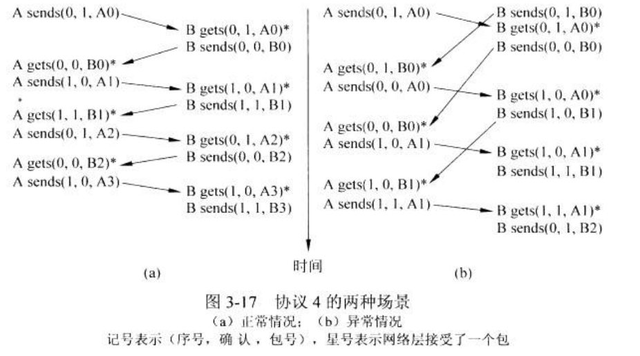
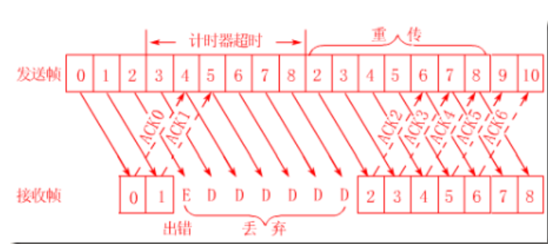
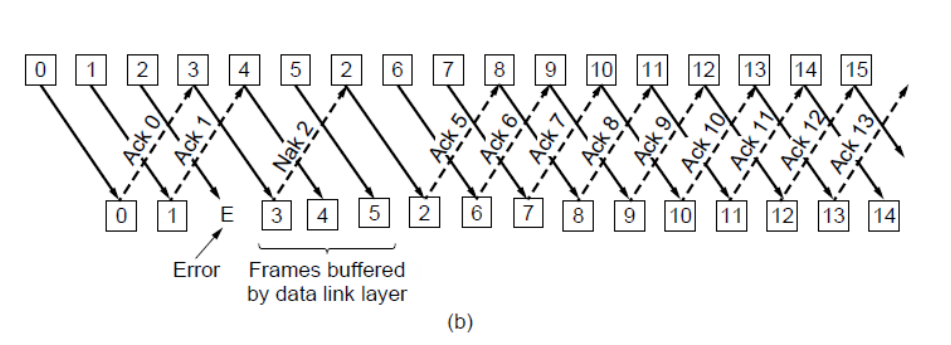

[TOC]
# 数据链路层(Data Link Layer)
## 设计问题
数据链路层使用物理层提供的服务在通信信道上发送和接收比特，它要完成功能包括
- 像网络层提供一个定义良好的服务接口
- 处理传输错误
- 调节数据流，确保慢速的接收方不会被快速的发送方淹没

将网络层获得的数据包Packet封装成帧以便传输
每个帧包括
- 帧头
- 有效载荷(存放数据包)
- 帧尾(校验)
### 提供给网络层的服务
越来越可靠

- 无确认的无连接服务
  - 源机器向目标机器发送**独立**的帧
  - 目标机器**不对帧进行确认**
  - 不用建立/释放逻辑连接
  - 不检测丢帧、也不恢复
  - 适用于
    - 错误率很低的场合、留给上层恢复的
    - 实时通信
- 有确认的无连接服务
  - 不用建立/释放逻辑连接
  - 但发送的每一帧都要单独确认
  - 发送方可以知道一个帧是否到达，因此可以再次发送
  - 适用于
    - 无线系统
    - WiFi
- 有确认的有连接服务
  - 传输之前建立连接
  - 每个帧编号
  - 对每个帧确认受到
  - 保证只接收一次、正确顺序
2 * 2 为什么少了一个

### Framing Methods
从bit比特流中识别出这是一帧

#### Byte count字节计数法
利用一个字段来标识该帧中的字符数
但一个错了后面都会出问题
因此很少使用

#### Flag bytes With stuffing字节填充的标志字节法
考虑了出错之后重新同步的问题
每个帧用一些特殊字节作为开始和结束，通常都相同，成为**标志字节(flag byte)**，作为起始和结束的分界符
失去了同步，只需要搜索两个标志字节就能找到当前帧的结束和下一帧的开始
但标志字节在数据中，歌曲/照片等，会严重干扰帧的分界
让每一帧用某种特殊的字节作为开始和结束的标志。两个连续的FLAG代表一帧结束，下一帧开始。
如果真正的数据中不小心包含了这个特殊字节，那发送方输出的就会在它前面添加一个**转义字节**，表示这不是我们要看的标志字节。接收方数据链路层会自动剔除这个转义字节。
PPP协议(Point-to-Point Protocol)

#### 比特填充的标志比特法
事实上，帧的划分不一定要按照以8bit为单位的字节，可以是比特级的划分。以一个特殊的比特模式来标志每个帧的开始和结束。利用01111110或0x7E标记。
当发送方发送的数据中出现**5个连续的1**，就要在输出的比特流中自动**填入一个0**（类似于上面的**转义操作**）。防止和开始结束标记重复。接收方会自动剔除这个0。

这种方法被HDLC(高级数据链路控制, High-level Data Link Control)协议所使用。

#### 物理编码违禁法
上面两种方法的缺点，显然是会增加帧的长度。
我们可以聪明地利用物理层的特点来避免转义位的使用。比特编码成信号通常包括一些帮助接收器同步的冗余比特，这些冗余代表一些信号不会出现在常规数据中。我们可以利用这些**保留的信号**来指示帧的开始和结束，也不再需要填充数据。

### 差错控制Error Detection Codes
无确认无连接服务就不用管，发送方只要把出境帧留存就可以了
另外两个需要确保所有的帧都被传递给目标机器的网络层，并且保持正确顺序

可能的情况
- 每一帧都到达: 接收方**发回一些特殊的控制帧**，对所接收到的帧进行肯定（代表正确接收）或否定（代表出现错误需要重传）
- 有一帧丢了: 如果一个帧丢了，接收方永远不会做出反应，在发送方发出一帧的同时启动一个**计时器**，并设置足够长的超时值。当收到确认帧后被取消。如果帧或确认帧丢失，计时器到时，一种显然的方案就是重发该帧
- 确认帧丢了：可如果只是确认帧丢了，那么重传就会造成重复接收同一帧。为了避免这种情况，可以给发送出去的帧**分配序号**，如果接收方连续收到两个相同序号就丢弃一个

### 流量控制
发送方太快了，接收方很慢，发送来的数据可能将接收方淹没

- 基于**反馈**的流量控制
  - **接收方给发送方反馈信息**，告诉它现在可以发多少数据，或者告诉它自己情况怎么样
  - 如果没有**接收方的许可**，发送方禁止继续发送帧
- 基于**速率**的流量控制
  - 利用内置机制，限制发送方的速率，仅在传输层(第5章)

## 差错的检测和纠正
在数据中加入冗余信息
- 纠错码error-correcting code其技术也成为前向纠错(FEC, Forward Error Correction)，能推断出发送的数据
- 检错码error-detecting code，能推断出是否出错
### Error-correcting code
#### Hamming codes海明码
- Hamming码是一种线性块码，用于检测和纠正**单个比特错误**。
- 它通过在数据位中插入冗余位来提供纠错功能，保证在传输过程中的错误检测和纠正。
- 海明码具有简单的编码和解码算法，主要应用于存储媒体、计算机内存和数据传输等领域。

#### Binary convolutional codes二进制卷积码
- 二进制卷积码是一种序列编码技术，用于检测和纠正序列中的**多个比特错误**。
- 它通过对输入比特序列进行线性卷积运算来生成输出比特序列，从而具有较高的纠错能力。
- 二进制卷积码广泛应用于数字通信领域，特别是在无线通信和卫星通信中常被使用。
#### Reed-Solomon codes里德所罗门码
- 里德所罗门码是一种**块码**，常用于纠正一定数量的错误和恢复数据。
- 它可以**纠正多个错误**，并且适用于处理**噪声较大**的信道。
- 里德所罗门码在数字通信、光盘存储、数据传输等领域有广泛应用。

#### Low-Density Parity Check codes低密度奇偶校验
- 低密度奇偶校验码（LDPC码）是一种**线性块码**，具有良好的纠错能力。
- 它使用**稀疏矩阵**表示编码和解码算法，能够有效地纠正传输过程中的比特错误。
- LDPC码被广泛应用于数字通信系统中，特别是在卫星通信和高速通信中有重要应用。

### 检错码Error-detecting code
[csdn](https://blog.csdn.net/jc_benben/article/details/107905030)
都是线性的系统块码
#### 奇偶
奇偶校验是检测错误的最古老的方法。用于检查数据传输的完整性。校验方法非常简单，只需要在数据上添加一个额外的位， 这个额外的位称为奇偶校验位。 该位简单地表示原数据中 1 的数量是奇数还是偶数

单个校验位只能可靠地检测出1位错误，但是出现严重乱码，那么这种错误被检测出的概率只有0.5
奇偶校验会消耗大量开销（通常每 8 个位就添加一个校验位），因此它会减慢传输速度

然后又改进交错校验
#### 校验和
校验和（checksum）是指传输位数的“累加”（加法操作可能不是普通整数加法）。奇偶校验和 LRC 可以说是校验和的一种形式（严格意义上来说，他们是异或，而不是和）。将奇偶校验的思想扩展，将消息中的字节汇总成一个校验字节（而不是奇偶校验的比特位），这个字节就是校验和
#### 循环冗余校验CRC
循环冗余校验（Cyclic Redundancy Codes，CRC）试图通过增加算法的复杂性来改进校验和。与校验和一样，CRC 用于检查大块数据，而不是奇偶校验中使用的单字符检查。CRC在错误检查方面比使用校验和要有效得多。
循环冗余校验（Cyclic Redundancy Check，CRC）是数据通讯中很常用的一种校验方式。尤其是在嵌入式开发中，经常要用到 CRC 算法对各种数据进行校验。通常用法为在传输或者储存之前计算出来的数字（称为校验码）附加到原数据后面，然后接收方进行检验确定数据是否发生变化。
CRC 是数据流采用二进制除法（没有进位，使用 xor 来代替减法）相除所得到的余数，这个余数通常被称为 CRC校验码，简称 CRC 码 。其中被除数是需要计算校验和的信息数据流；除数是一个长度为 n+1 的预定义的二进制数（用多项式的系数来表示）。在做除法之前，要在信息数据之后先加上 n 个 0。当 CRC 的校验值为 n 位长时，CRC 称为 n 位CRC，通常写为 CRC-n。

## 基本数据链路层协议
[csdn](https://blog.csdn.net/weixin_44757234/article/details/112473247)

帧的种类
- 信息帧：有效数据
- 管理帧：网络的连接建立、释放等
- 控制帧：控制数据链路层的操作和处理、传输的速率、流量控制等
### 底层通信模型的基本假设
- 假设物理层、数据链路层和网络层都是独立的进程，他们通过来回传递消息进行通信。
- 主机A希望用一个可靠的面向连接的服务向主机B发送一个长数据流，假设A的数据链路层请求数据时，网络层总能立即满足数据链路层的需求。
- 假设主机不会崩溃。
### 单工协议
#### 乌托邦式单工协议
- **不考虑任何出错情况(没噪声，$S/N \rightarrow \infin $)**。
- 数据只能单向传输。
- 接收方缓冲区无限大。
- 不管流量控制(不管收没收到、能否处理那么多/少)。
- 接收方处理数据时间无限快。
- 接收方和发送方的网络层总是处于准备就绪状态

协议由两个单独的过程组成：运行在源主机上的发送过程，运行在目的主机上的接受过程。
发送过程是一个**无限的while循环**，尽可能快地把数据放在线路上，不管对方收没收到，处理没有。
接收过程是在等待唯一可能的事件，即到达了一个未损坏的帧发生。
整个处理过程接近于无确认的无连接服务，差错控制和流量控制就要依赖上层解决了。（当然，即使无确认的无连接服务也要做一些差错检测的工作。）

```c
// only one event type
typedef enum {frame_arrival} event_type;
#include "protocol.h"
void sender1(void) {
  frame s;
  packet buffer;
  while (true) {
    from_network_layer(&buffer);
    s.info = buffer;
    to_physical_layer(&s);
  }
}

void receiver1(void) {
  frame s;
  event_type event;
  while (true) {
    wait_for_event(&event);
    from_physical_layer(&r);
    to_network_layer(&r.info);
  }
}
```
#### 无错信道上的单工停-等协议
- 不考虑通信信道出错。
- 数据只能从发送方传到接收方，但帧可以在两个方向上传送(交替成为发送方和接收方)。
- 考虑了接收方接收速率和发送方发送速率不匹配的问题，即进行***流量控制***。

此问题的一种解决方案显然是建立足够强大的接收器，但这对硬件要求极高，且只是把发送方太快这个问题转移到了网络层考虑。
更一般的解决方案是：接收方从帧中取出数据包并传递给网络层后，给发送方返回一个**哑帧，允许其发送下一帧(反馈信息)**。这种**双向传送是交替关系**，可使用**半双工**的物理信道。

```c
// only one event type
typedef enum {frame_arrival} event_type;
#include "protocol.h"
void sender2(void) {
  frame s;
  packet buffer;
  event_type event;
  while (true) {
    from_network_layer(&buffer);
    s.info = buffer;
    to_physical_layer(&s);
    wait_for_event(&event);       // sleep until given the dummy frame
  }
}
void receiver2(void) {
  frame r, s;
  event_type event;
  while (true) {
    wait_for_event(&event);
    from_physical_layer(&r);
    to_network_layer(&r.info);
    to_physical_layer(&s);      // send a dummy frame to awaken sender
  }
}
```
#### 有错信道上的单工停-等协议
- **考虑通信信道出错**，若一帧在传输过程中被损坏，接收方可以检测出来，即进行差错控制。
- 数据只能从发送方传到接收方，但帧可以在两个方向上传送。
- 考虑了**接收速率和发送速率不匹配**(流量控制)的问题。

如果只是简单的在发送方设置定时器，超时重传，**那么当确认帧丢失时，就会造成帧重复，也可能导致发送方阻塞**，因此要让发送方在每个帧的头部加入序号，接收方检查序号判断是否为重复帧。
当m号帧发出，代表m-1号帧必定已经被确认，则此时的问题就与m-1号帧完全无关了，因此，序号关系可仅限于后两者，即m和m+1之间，换言之，只需要,一位序号就足够了，即0和1。
发送方发出一帧后启动计时器，若

1. 收到完好确认帧：从网络层获取下一个数据包放入缓冲区覆盖之前的。
2. 收到**受损确认帧或计时器超时**：**不改变缓冲区内容和序号，重传上一帧**(发送方的数据和接收方的回应都有可能被噪声影响)。

接收方收到有效帧后，检查其序号，若

1. 不是重复帧，去封装传递给网络层。
2. 为重复帧，**重新向发送方发送这一帧的确认**

这样的协议成为**自动重复请求(ARQ, Automatic Reqeat reQuest)** or **带有重传的肯定确认(PAR, Positive Acknowledge with Retrasmission)**

```c
// THREE types !
typedef enum {frame_arrival, cksum_err, timeout} event_type;
// cksum_err means check sum error 

#include "protocol.h"

void sender3(void) {
  seq_nr next_frame_to_send;
  frame s;
  packet buffer;
  event_type event;
  next_frame_to_send = 0;
  
  from_network_layer(&buffer);
  while (true) {
    s.info = buffer;
    s.seq = next_frame_to_send;
    to_physical_layer(&s);
    start_timer(s.seq);
    wait_for_event(&event);               // sleep until the event is given
    if (event == frame_arrival) {         // if not the "frame_arrival", just send again
      from_physical_layer(&s);            // check the dummy frame
      if (s.ack == next_frame_to_send) {  // good dummy frame
        stop_timer(s.ack);
        from_network_layer(&buffer);
        inc(next_frame_to_send);
      }
    }
  }
}

void receiver3(void) {
  seq_nr frame_expected;
  frame r, s;
  event_tpye event;
  frame_expected = 0;
  while (true) {
    wait_for_event(&event);
    if (event == frame_arrival) {
      if (r.seq == frame_expected) {
        to_network_layer(&r.info);
        inc(frame_expected);
      }
      s.ack = 1 - frame_expected;         // 可能有重发，这里判断是不是想要的，然后反馈回去
      to_physical_layer(&s);
    }
  }
}
```

但是这是半双工的，在等待的同时我们希望还可以给发送/接收，因此有下面的方法

#### 滑动窗口协议(全双工)
##### 引入
实际上需要两个方向上同时传输数据
做法改进过程
- 两条链路传输，每个实例使用一条独立的链路进行单工数据传输，但是浪费带宽
- 同一条链路来传输两个方向上的数据，检查Kind字段区分是数据帧还是确认帧
- 当到达一个数据帧时，接收方并不是立即发送一个单独的控制帧，而是已知自己并开始等待，知道网络层传递给它下一个要发送的数据包。然后确认信息**附加**在往外发送的数据帧上(ack字段)。这种延迟确认以便将确认信息搭载在下一个数据帧上的技术成为**捎带确认(piggybacking)**

- 捎带确认的好处：利用了信道的可用带宽，ack字段只占用很少的几位
- 捎带确认的不足：要等多长时间呢，超时了时继续等下去还是发送一个单独的确认帧
##### 滑动窗口概述
- 效率、复杂性和缓冲区需求等各方面有所不同
- 任何一个**出境帧都包含一个序号**，ranging 0 to a certain maxium which usually is set as $2^n - 1$, cause it can be filled into a n-bit field.
- 本质都是在任何时刻发送方**维持一组序号**，分别对应**允许它发送的帧**。则称这些帧落在发送窗口内。接收方同样也维持接收窗口。
  - 但发送窗口和接收窗口不必有相同的大小
  - 发送窗口对发送方进行**流量控制**，窗口大小即为没收到对方确认的情况下最多可以发送多少数据帧
  - 接收窗口控制可以接收哪些序号的数据帧，不在窗口内就一律丢弃
  - 发送端每收到一个确认帧，发送窗口就向前滑动一个帧的位置，当发送窗口内没有可以返送的帧(即窗口内都已经发送，但没有全部收到确认帧)，发送方停止
- 分类
  - 一位滑动窗口协议
    - 发送窗口大小 = 接收窗口大小 = 1
  - 退后N帧协议
    - 发送窗口大小 > 1, 接收窗口大小 = 1
  - 选择重传协议
    - 发送窗口大小和接收窗口大小都 > 1

##### 一位滑动窗口协议
发送方发送单个帧后就必须等待确认，在接收方的回答到达源站之前，发送方不能发送其他的数据帧

类似双方对等的有错信道上的单工停-等协议
```c
#define MAX_SEQ 1
typedef enum { frame_arrival, cksum_err, timeout } event_type;
#include "potocol.h"
void protocol4 (void) {
  seq_nr next_frame_to_send;
  seq_nr frame_expected;
  frame r, s;
  packet buffer;
  event_type event;

  next_frame_to_send = 0;
  frame_expected = 0;

  from_network_layer(&buffer)
  s.info = buffer;
  s.seq = next_frame_to_send;
  s.ack = 1 - frame_expected;
  to_physical_layer(&s);

  start_timer(s.seq);
  while (true) {
    wait_for_event(&event);
    // 有帧到来
    if (event == frame_arrival) {
      // 接收
      from_physical_layer(&r);
      // 检查是否是想要的
      if (r.seq == frame_expected) {
        to_network_layer(&r.info);
        inc(frame_expected);
      }
      // 检查确认帧
      if (r.ack == next_frame_to_send) {
        stop_time(r.ack);
        from_network_layer(&buffer);
        inc(next_frame_to_send);
      }
    }
    s.info = buffer;
    s.seq = next_frame_to_send;
    s.ack = 1 - frame_expected;
    to_physical_layer(&s);
    start_timer(s.seq);
  }
}
```
的那时如果A、B双方同时发起通信，它们的第一帧就会交错，此时及时没有传输错误，仍然会同一帧传输多次，浪费带宽

发送方一般`seq`和`ack`两个不同，两个相同了就是重新发送的了

##### 后退N帧
发送方不需要受到上一帧的确认帧之后才能开始发送下一帧，可以连续发送。
当接收方检测出失序的信息帧之后，会要求发送方重发**最后一个正确信息帧之后的所有未被确认的帧**(接收方只允许按照顺序接收)

为了减少开销，后退N帧协议还规定接收方不一定每收到一个正确的数据帧就必须立即发回一个确认帧
- 可以在**连续收到好几个正确的数据帧后，才对最后一个数据帧发送确认信息**
- 可以在当自己有**数据要发送的时候**才将对以前正确收到的帧加以捎带确认

好处无疑是提高了效率， 但是一旦网络情况糟糕，则会导致大量数据重发，反而不如上面的停等协议


这里发送方连续发送10个数据帧，前面两正确返回确认帧，但是第三个出现了错误，这时发送方被迫重新发送2-8这7个帧，接受方也必须丢弃之前接受的3-8这几个帧

##### 选择重传协议
选择重传ARQ可以看做是发送窗口 > 1 ，接收窗口 > 1的滑动窗口协议，其会在**接收端缓存**所有收到的帧，当**某个帧出现错误则只需要重传这个错误的帧即可**，即一旦接收方怀疑帧出错，就会发送一个否定帧NAK给发送方，要求发送方对NAK中制定的帧进行重传，只有当收到的帧序号都正确了才会往高层应用传递

直到所有序号比某个帧小的那些帧都已经发送Ack然后交给网络层了，这个帧才能交给网络层

所需要的缓冲区大小为窗口的大小，所需要的计时器数量也等同于缓冲区的数量(但这里使用一个物理时钟，用软件链表模拟多个独立时钟)

0、1发送完Ack就可以交给网络层了，但是2出错了，因此3、4、5存在缓冲区，还不能交给网络层，需要等待2的重传然后确认Ack
但是收到2的时候为什么发回去的是Ack5呢，这里直接代表2、3、4、5都确认了(**累计确认**（cumulative acknowledgement）)
如果发送Ack2会出现混乱、歧义

缺点是在服务器端需要更多的缓存

[为什么窗口大小不能超过序列号的一半](https://www.zhihu.com/question/23951069)

## hw
1, 2, 3, 4, 5, 6, 19, 20, 21, 26, 27, 28, 32, 34