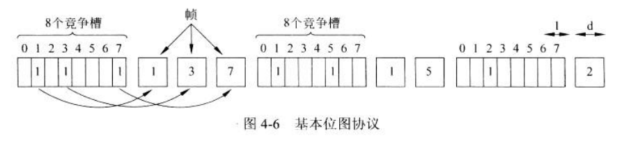

# Mac(Medium Access Control Sublayer)
所有网络有公共的资源分配的问题

用来确定**多路访问信道下一个使用者**的的协议属于数据链路层的一个子层-MAC

## 信道分配问题
Single Channel，没有别的通道可以走，因此需要竞争

### 静态信道分配
传统做法是把信道容量拆开分给多个用户使用
XX多路复用技术

假设有N个用户，将整个带宽分成N等份
- 此时很少用户，浪费带宽
- 此时很多用户，有些用户因带宽不够而被拒绝

不适应突发性的流量

### 动态信道分配假设Assumption for Dynamic Channel Allocation
关键假设
- 流量独立
    N个独立的站组成，每个站都有一个程序/用户产生要传输的帧。在长度为$\Delta t$的间隔内，期望产生的帧数为$\lambda \Delta t$。其中$\lambda$为常数，新帧的到达率。一旦生成出一帧，则站就被**阻塞**，直到该帧成功发送出去。
- 单信道
    所有通信都是用一个信道。所有的站可以在该信道上传输数据，也可以接收数据。所有站的能力相同(但是协议可能分配不同的角色(优先级))
- 冲突可观察
    若两帧同时传输，时间上重叠，产生的信号时混乱的，即为**冲突**。所有的站都能够检测到冲突事件的发生。冲突的帧需要再次发送。
    除了因冲突而产生错误外，不会再有其他的错误。
- 时间连续/分槽
    时间假设连续，即任何时刻都可以开始传输帧。
    可以假设不连续，把时间分成离散的间隔(时间槽)。帧的传输只能从某个时间槽的起始点开始。一个时间槽对应0、1或多个帧，对应空闲、一次发送成功或一次冲突
- 载波侦听/不听
    CSMA/CD(允许冲突存在)
    站需要用信道之前应该直到信道当前是否正在被使用，信道忙就不去用。
    如果没有载波侦听，站盲目传输，以后再判断是否成功

## 多路访问协议MUltiple Access Protocol
### ALOHA

#### pure ALOHA
用户有数据**需要发送时就传输**，可能会冲突碰撞损坏，帧损坏了就等待**随机**一段时间再发送
#### Slotted ALOHA
将时间分成离散的时间间隔(时间槽)，每个时间槽对应一帧
取得同步时间的一种方法是由一个**特殊的站**在每个时间间隔的起始发送脉冲信号
不允许用户每次有数据就力矩发送，而是等待下一个时间槽的开始时刻
### Carrier Sense Multiple Access

载波侦听多路访问协议

站监听是否存在载波(是否由传输)，据此采取相应动作
#### 坚持和非坚持CSMA
- 1-persistent CSMA: 最简单的CSMA，一个站有数据要发送的时候，首先侦听信道，确定有载波就一直等到空闲，没有就发送。如果还冲突了还是等待**随机**一段时间
- nonpersistent CSMA: 发送数据之前先侦听信道。没有载波就发送，有则并不持续对信道监听。直接等待**随机**一段时间，然后重复上述步骤
- p-persistent CSMA: 使用于分时间槽的信道。数据准备好，就侦听信道，空闲就**按照概率p发送数据**，以概率**1-p的概率推迟到下一个时间槽**

#### CSMA with Collision Detection
带冲突检测的CSMA/CD广泛使用
坚持和非坚持CSMA协议确保了信道忙时，所有的站都不再传输数据。
但如果**两个站都侦听到信道为空，并且同时开始传输，则它们的信号仍然会产生冲突**
这里改进是**每个站快速检测到发送冲突后立即停止传输帧**

站的硬件在传输时侦听信道，如果他读回的信号**不同于**它写到信道上的信号，就知道发送了collision，就立即终止自己的传送，等待**随机**一段时间
(根据**自身**的状况，想发就发，不用管其他的)

简单，差错小

侦听实现流量控制

但这里似乎没有处理出错的机制，其实是交给上一层(网络层)纠错了

假设两个站同时在$t_0$时刻开始传输数据，需要多长时间才能意识到发生了冲突呢
检测冲突的最小时间，是将信号从一个站传播到另一个站所需要的时间

### Collision-free Protocols
#### Bitmap Protocol
位图协议

事实上存在着很大的问题，如何把节奏统一起来，在规定的时间确定竞争位槽
如果有专门的管理机构维护整个系统的通信，但是不扁平化了，在现有主流的系统中不受欢迎

#### Tokon Ring 传递
令牌代表了发送权限，如果一个站有等待传输的帧队列，接收到令牌后就可以发送帧，然后再把令牌传递到下一站

#### 二进制倒计数Binary Countdown
根据站的地址(本身属性)排序
但是存在某个站算出来的就是小那么就一直在后排

### Limited-contention Protocols
有限竞争协议
获取信道
- 竞争的方法：CSMA
- 无竞争协议

在负载轻的情况下，竞争方法更好，延迟短(冲突少发生)
但负载重的情况下，无冲突协议信道的效率反而更好(开销固定)

竞争协议和无冲突协议结合！即为**有限竞争协议**

#### 对称协议
每个站企图获得信道的概率为p，一共k个站
如果一个站成功传输了，而所有的k - 1个站以1 - p概率把传输延缓到下一个时间槽，故有$kp(1-p)^{k-1}$

因此越多站竞争成功概率越小

于是有限竞争协议将所有的站**划分成组**减少竞争数量

#### 自适应树遍历协议
信道分配的方法
对于0号槽，允许所有站尝试获取信道，之中的一个获取了信道，就很好；但是如果有冲突，在1号槽中，只有位于2号节点之下的站才可以竞争。
其中某个站获得了信道并且发送完成之后，这个槽保留给3号节点之下的站竞争

### 无线局域网协议
两个问题

- A发送给B的时候，C不知道A在发送，也发送给B(不应该发送)**隐藏终端问题**
- B发送给A的时候，C以为B发送了会干扰，就不发送(应该发送)**暴露终端问题**

**冲突避免多路访问**
MACA, Multiple Access with Collision Avoidance
发送方刺激接收方输出一个短帧，以便使其**附近的站都能检测**到这次传输，从而**避免在接下去进行的较大的数据帧传输中也发送数据**(由此代替载波侦听)

A想要发数据给B
- A先发送RTS(Request To Send)，包含了要发送数据的长度
- B再发送CTS(Clear To Send)，从RTS复制，包含了发送数据的长度
- A收到CTS就开始传输

其他在范围内的站听到了RTS，距离A比较近，保持沉默，等待足够长的时间以便在无冲突情况下CTS被返回给A
其他的范围内的站听到了CTS，距离B比较近，在接下来传输数据的过程中保持沉默，**它们知道要发送的数据的长度即大概直到要持续多久**

此时，C在A的范围不在B的范围，只要没有干扰CTS，可以自由地发送任何信息
D在B的范围，不在A的范围，在延缓发送任何信息直到AB完成传输
E在A、B的范围，和D一样

这只是减少冲突，若B、C同时给A发送RTS，就冲突了，不成功的发送方(在指定时间内没收到CTS)等待随机一段时间重试

## 以太网802.3
以太网有两类，有很大不同
- 经典以太网
  - 本章已经学过的技术解决多路访问问题
  - 原始形式，速度只有3-10Mbps
  - 总线型
  - 半双工，只有一个信道
- 交换式以太网
  - 通过交换机连接不同设备
  - 100、1000、10000Mbps高速率
  - 快速以太网、千兆以太网、万兆以太网
  - 现在在使用的

### 经典以太网物理层
长电缆围绕建筑物，连接着所有的计算机

- 粗以太网
  - 长
  - 贵
  - 每段电缆处理计算机多
- 细以太网
  - 短
  - 便宜
  - 每段电缆处理计算机少

每个版本都有电缆的最大长度限制，在这个范围内信号才能正常传播

更大的网络就要靠**中继器**(repeater物理层设备，接受放大，并在两个方向上重发信号)

### 经典以太网MAC子层协议
帧格式

- 8个字节的前导码(Preamble)，每个字节包含比特模式10101010(除了最后一个字节的最后2位位11)。这最后一个字节称为802.3的帧起始定界符(Start of Frame, SOF)
- 6个字节的地址字段
  - 目标地址
    - 目标地址第一位是0：普通地址
    - 目标地址第一位是1：组地址，该组中所有站都要接受它
      - 发送行为称为**组播**(multicasting)
    - 目标地址全是1：特殊地址用作**广播**(broadcasting)，网络上的所有站都接收
  - 源地址
    - 全球唯一性，由IEEE统一分配
    - 48位数字
    - 前三个字节用作表示该站所在的**组织唯一标识符**(OUI, Organizationally Unique Identifier)，由IEEE分配，指明了网络设备制造商
    - 后三个字节制造商负责分配
- Type还是Length字段
  - 取决于是以太网帧还是IEEE 802.3帧
  - 以太网帧告诉操作系统要用哪个**网络协议**处理
  - IEEE 802.3则根据**逻辑链路控制**(LLC, Logical Link Control)协议头来处理没有type的情况，然而太多使用DIX以太网硬件的，IEEE只能认输！
- Data字段，最多包含1500个字节，并且要求有效帧必须至少64字节长，太少了就用Pad字段填充
  - 更容易区分有效帧和垃圾数据
  - 太短了，还没到点来远端的发送方，传输就结束了，而电缆的远端可能与另一个帧发生冲突
  - 
- 校验和CRC，只提供检错功能，检测到一个错就丢弃

**目标地址字段在源地址字段前面的主要原因是为了提供更快的转发和处理速度**

还使用**二进制指数后退的CSMA/CA**
1-persistentCSMA/CD算法，站的所有帧需要发送是都要侦听，一旦空闲立即发送
- 有冲突，立刻终止传输，并发出**短冲突加强信号**，等待一段随机时间重发
- 没有冲突，发送

主要是**等待时间**通过二进制后端算法计算得出，每次碰撞后，退避时间会以指数方式增加，以减小碰撞的概率，即第$i$次冲突发生后，从$0 \sim 2^i - 1$之间**随机选择一个数，等待这么多个时间槽**
- 固定最大值1023
- 16冲突之后，控制器放弃，给计算机失败报告

优缺点
- 动态适应发送站的数量，所有冲突的随机数最大值都是1023，两个站第二次冲突的概率很小
- 一次冲突之后的平均等待时间将是数百个时间槽，很大延迟

### 以太网的性能

### 交换式以太网
单根电缆存在问题 -> 开发出一种不同类型的**布线模式**
每个站都有一条专用电线连接到一个中央集线器(只是在电气上连接所有的连接线)

**考试爱出中央集线器HUB，但是很old-fashioned**
优缺点
- 易于维护
- 使用现有布线
- 但不能增加容量，每个站获得的固定容量共享份额下降，LAN将会饱和

于是有了**交换机**(switch)，处理不断增长的负载

### 快速以太网
是原有的802.3标准的补充
- 保留原本的帧格式、接口和过程规则
- 只是将比特时间100ns -> 10ns(只需将电缆的最大长度降低到十分之一，以便即使检测冲突)

允许的三种可能介质

全双工！

### 千兆以太网
802.3ab
- 增加十倍的新跟那个
- 保持与所有现存以太网标准的兼容
- 必须提供单播和广播的无确认数据报服务
- 点到点链路，但一般使用一个交换机或者集线器连接多台计算机或额外的交换机或集线器

支持的操作模式
- 全双工模式(正常)
- 半双工模式(计算机连接到集线器的时候)

加入两个特性，使得25米长度限制增加到200米
- 载波扩充: 让发送方硬件在普通的帧后面增加填充为，扩充到512字节，然后让接收方硬件删除
- 帧突发: 允许发送方将多个待发送帧级连在一起，一次传输出去，如果仍小于510字节，就再次硬件填充(高效，优先于载波扩充)

### 万兆以太网
数据中心和交换局内部，连接高端路由器、交换机和服务器

一般只支持全双工

### 以太网回顾
**标准以太网发送数据不需要对方应答**
**无连接、无确认**
**说以太网没有校验是错误的**，发现错了就丢了

## 无线局域网
### 802.11体系结构和协议栈

使用模式
- 有架构模式: 每个客户端与接入点关联，接入点再与其他网络连接，收发都要经过AP
- 自组织网络: 计算机相互关联，没那么受欢迎

### 802.11物理层
使用OFDM正交频分复用，更有效率

### 802.11 MAC子层协议
无线电几乎总是**半双工**的，不能再同一个频率上传输的同时监听该频率上的突发噪声(接收到的信号很容易变得比发射信号弱一百万倍)

试图避免冲突，采用带有冲突避免的CSMA(CSMA/CA, CSMA with Collision Avoidance)

不稳定不可靠，才要这样复杂的协议

后退算法

和以太网的区别
- 早期的后退有助于避免冲突
- 利用确认来推断是否发生冲突(冲突无法被检测出来)

这种操作模式被称为**分布式协调功能**(DCF, Distributed Coordination Function)
其实还有一个比较少用的，AP控制自己覆盖范围内的一起活动，称为**点协调功能**(PCF, Point Coordination Function)，但通常没有办法组织临近网络中的站发送竞争流量

虚拟信道侦听

RTC/CTS机制
...

### 802.11 帧结构

为什么这里需要三个地址(实际上甚至更多)
传输基本都通过AP，因此有记录AP的地址，也有远端地址

## 蓝牙

通过**配对**，基本单元是一个**微网**

头部校验

### 协议栈

### 帧结构

## 数据链路层交换
使用称为**网桥**(bridge)的设备连接这些局域网
网桥非常古老的概念，还是用交换机吧
交换机是数据链路层，不能看到IP地址，只知道MAC地址
### 网桥的使用
需要两种算法
- 向后学习算法(backward learning)，用来组织不需要发送的流量
- 生成树算法

### 学习网桥

学习型的，知道物理端口

每个交换机配置一个大哈希表，列出每个可能目的地以及它隶属的输出端口
**泛洪算法**(flooding algorithm): 对于每个发向未知目标地址的入境帧，网桥将它输出到所有的端口(除了入口端口)，随着时间推移，网桥将会学到每个目标地址在哪里。一旦知道了一个目标地址，以后发给该地址的帧就会放到正确的端口

### 生成树网桥
不轻易丢弃，不知道去哪，除了入口，其他的都发一遍
那大量要发送的时候，就要有必要的切断**环路**，不然网络瘫痪

## 各层的设备
| Layer | Device |
|:--:|:--:|
|应用层|Application gateway|
|传输层|Transport gateway|
|网络层|Router|
|数据链路层|Bridge, Switch|
|物理层|Hub, Repeater|

- 网关有各种各样的
- 一层只能看见一层的数据，例如路由器只能看到IP地址，不知道MAC地址
- Repeater检测到信号衰减的时候，就会进行放大和重新发送，延长信号的传输距离
- Hub就是一堆连在一起

每一层都加一些包裹(头、尾)

## 802.1Q
802.1Q标准的提出主要是为了解决虚拟局域网（VLAN）中的问题。VLAN是一种将一个物理网络划分为多个逻辑上独立的虚拟网络的技术。在传统的以太网中，所有设备都处于同一个广播域中，广播和多播流量会在整个网络中传播，导致网络性能下降和安全性问题。

802.1Q标准**引入了VLAN标记（VLAN tagging）**的概念，使得网络管理员能够将数据包划分到不同的VLAN中。它通过在以太网帧的头部添加一个额外的VLAN标记字段来实现。这样，**同一物理网络上的不同VLAN的设备可以通过VLAN标记来区分**，并且数据包只会在相应的VLAN中进行广播和传输，从而解决了广播域扩散和冲突的问题。

802.1Q标准还定义了一些VLAN管理的协议和操作，如VLAN的创建、删除和配置，VLAN成员的管理以及VLAN间交互的方式等。它提供了一种灵活的方式来组织和管理网络，提高了网络的性能、可扩展性和安全性，同时也促进了各种网络设备的互操作性。

## hw
1, 6, 8, 10, 13, 16, 18, 25, 38