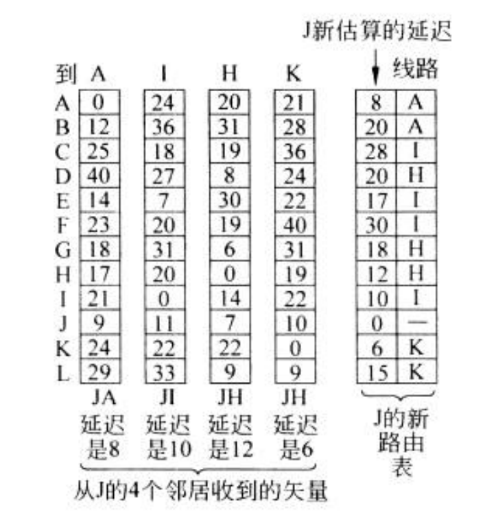

# Network Layer
关注如何**将源端数据包一路送到接收方**，可能需要经过很多hop中间路由器
是处理**端到端数据传输的最底层**

要干的事就是**存储、转发**

因此网络层必须知道网路拓扑结构(所有路由器和链路的集合)，并从中选择合适的路径
## 网络层的设计问题
### 基于存储转发的数据包交换

网络中最主要的组件时**网络服务提供商(ISP)的设备和客户端设备**，利用圆圈区分

一台主机发送一个数据包，先将其传输给最近的路由器。
到达路由器后，完成对它的校验和验证之后，**存储到路由器**上，然后再沿**着路经转发**给下一个路由器，直至到达目标主机

### 提供给传输层的服务
通过接口向传输层提供服务
- 向上提供的服务应该独立于路由器技术
- 应该向传输层屏蔽路由器的数量、类型和拓扑关系(传输层不关心)
- 传输层可用的网络地址应该有一个同一个编址方案，甚至可以跨越LAN、WAN

争议焦点在于网络层是提供面向连接的服务还是无连接的服务
- 无连接的观点认为网络不可靠，主机应完成错误控制和流量控制任务，网络服务只需提供简单的原语如SEND PACKET和RECEIVE PACKET。
- 面向连接的观点认为网络应提供可靠的、面向连接的服务，例如电话系统的成功经验可作为参考。

发展
- **早期数据网络主要采用面向连接**的服务，但随着ARPANET和早期Internet的发展，**无连接网络层（如IP协议）得到普及。**
- 现今的网络演化中，服务质量变得越来越重要，一些面向连接的特性如**MPLS和VLAN**得到广泛应用。

网络层根据提供的服务类型可以采用两种不同的组织方式：**数据报网络和虚电路网络**。

### 无连接服务的实现
- 数据报网络提供**无连接**的服务，数据包**独立注入**到网络中，每个数据包独立路由。数据包也被称为数据报。
  - 数据报网络中，消息经传输层加上传输头后交给网络层，网络层根据目标地址将数据包转发到适当的路由器。
  - 每个路由器通过内部表进行数据包转发，表项指示目标地址和出境线路。
  - 路由器根据路由表将数据包转发到下一个路由器，直到达到最终目的地。
  - 路由器之间的**路径**可能根据**路由算法的结果而不同**，路由算法用于**管理路由表和选择路由路径**。
- IP协议是无连接网络服务的重要范例，每个数据包携带目标地址，路由器根据该地址独立转发数据包。
- IPv4使用32位地址，IPv6使用128位地址。
- 实际使用的就是这种

### 面向连接服务的实现
面向连接的服务使用**虚电路网络**，其中**连接建立时确定了源机器到目标机器之间的路径，并保存在中间路由器的表中**。
- 虚电路网络避免了为每个数据包选择新路径，而是使用**连接建立时确定的路径**来转发整个连接上的流量。
- 每个**数据包**在面向连接的服务中**包含一个连接标识符**，指示它属于哪条虚电路。
- **路由器的表中记录了连接标识符和对应的路径**，用于将数据包转发到正确的目标。
- 如果有多个连接存在，路由器需要能够区分不同连接的数据包，通常使用不同的连接标识符来实现。
- **标签交换**（label switching）是一种用于虚电路网络的方法，其中**数据包被包裹在带有连接标识符或标签的头部中**。
- **MPLS**（MultiProtocol Label Switching）是面向连接的网络服务的一个例子，它使用标签交换来建立连接并进行数据包转发。

### 虚电路和数据报网络的比较
|问题|数据报网络|虚电路网络|
|:--:|:--:|:--:|
|电路建立|不需要|需要|
|寻址|每个包包含全部的源和目标地址|每个包包含简短的VC号|
|状态信息|路由器不保留连接状态|针对每个连接、每条VC都需要路由器保存其状态|
|路由方式|每个数据包被单独路由|建立VC时选择路由，所有包都遵循该路由|
|路由器失效的影响|没有影响，除了那些路由器崩溃期间丢失的包|穿过故障路由器的所有VC都将中断|
|服务质量|困难|容易，如果在于先建立每条VC时有足够的资源可分配|
|拥塞控制|困难|容易，如果在于先建立每条VC时有足够的资源可分配|

当涉及到网络内部的数据报和虚电路网络时，有几个方面需要权衡考虑：

1. **建立时间和地址解析时间**：虚电路网络需要在建立阶段花费时间和消耗资源，但一旦建立完成，处理数据包变得简单。路由器只需使用电路号索引表中的目标地址即可。而数据报网络不需要建立电路，但路由器需要执行更复杂的查找过程以找到目标表项。

2. **目标地址长度**：数据报网络的目标地址具有全局意义，因此通常比虚电路网络所用的电路号更长。如果数据包很短，并且每个数据包都包含完整的目标地址，可能会导致大量协议开销和带宽资源浪费。

3. **路由器内存需求**：在数据报子网中，每个可能的目标地址都需要一个表项，而在虚电路网络中，每条虚电路只需要一个表项。然而，虚电路网络在建立连接阶段也需要路由数据包，并且它们也使用目标地址。

从**保证服务质量和避免网络拥塞**的角度来看，**虚电路具有优势**。在建立连接时，可以提前预留所需的资源，如缓冲区空间、带宽和CPU周期。一旦数据包开始到达，所需的带宽和路由器容量已准备就绪。对于数据报网络来说，避免拥塞更为困难。

对于**事务处理系统**（如通过电话验证信用卡有效性的商场购物），建立和清除虚电路所需的开销可能会削弱虚电路的优势。**如果大部分流量都是这种类型**，那么在网络内部使用虚电路可能没有意义。然而，对于**长期运行的VPN流量**等情况，**使用永久性虚电路可能更有用**（手动建立虚电路，并持续使用几个月或几年）。

**虚电路还存在脆弱性问题**。如果路由器崩溃并且内存中的数据丢失，即使在重新启动后的一秒钟内，所有通过该路由器的虚电路也将中断。相反，如果数据报路由器宕机，只有那些仍在路由器队列中的数据包的用户会受到影响（甚至这些用户也不会全部受到影响，因为发送方可能很快重新传输这些数据包）。对于使用该线路的虚电路来说，通信线路的故障是致命的，但对于使用数据报的情况来说，这种故障很容易补救。数据报还允许路由器在网络流量上进行平衡，因为长序列数据包的传输路径可以在传输过程中更改。

## 路由算法
路由算法是网络层软件的一部分，**负责确定入境数据包应该发送到哪条输出线路上**。

在数据报网络中，每个数据包到达时都需要重新选择路径，每次的最佳路径可能改变；而在虚电路网络中，只有在建立新的虚电路时才需要做路由决策，因此称为**会话路由**。

拥有独立**路由**和**转发**功能的路由器可以被看作有**两个进程**，其中一个处理每个到达的数据包并根据路由表进行转发，另一个进程负责生成和更新路由表。

路由算法应满足一**些特性**，包括正确性、简单性、鲁棒性、稳定性、公平性和有效性。
- 鲁棒性是指路由算法能够处理硬件和软件故障、网络拓扑结构变化和流量方面的各种变化，而不需要停止所有主机的工作。
- 稳定性是指路由算法能够收敛到一个固定的路径集合，且能够快速达到平衡状态。
- 公平性和有效性是两个相互矛盾的目标，需要在全局效率和单个连接公平性之间进行权衡。
  - 在确定公平性和有效性之间的权衡办法之前，需要确定要优化的性能指标。最小化数据包的平均延迟和最大化网络的总吞吐量是常见的选择，但这两个目标是相互冲突的。
  - 一种折中方法是尝试减小数据包经过的跳数，从而减小延迟并提高整个网络的吞吐量。

路由算法可以分为**非自适应算法**和**自适应算法**。
- 非自适应算法是**预先计算好的路由选择**，在网络启动时下载到路由器中，**无法根据当前测量或估计的流量和拓扑结构进行调整**。
- 自适应算法**会根据拓扑结构和流量的变化来调整路由决策**。它可以从不同的信息源获取信息，并根据不同的时间间隔或度量指标来改变路径。

路由算法涉及传递模式，有时需要将数据包发送到多个地址、全部地址或一组目标地址中的一个。

这里讨论的**路由算法都基于拓扑结构**进行路由决策，而基于流量水平的路由决策将在后续章节中介绍。

### 优化原则
最优化原则（optimality principle）指出，如果路由器J在从路由器Ⅰ到路由器K的最优路径上，那么从J到K的最优路径也必定遵循相同的路由。`I --- J --- K`
这一原则有助于确定最优路径和汇集树的构建过程。

**汇集树**（sink tree）是**从所有源到指定目标的最优路径构成的树状结构**，以**目标节点为根**。所有的路由算法的目标是为每个路由器找到汇集树，并根据汇集树进行数据包转发。
  - 汇集树可以作为便利速记，但**并不一定是唯一的**，可能存在具有相同路径长度的其他汇集树。如果允许选择所有可能的路径，则树将变成有向无环图（DAG）的更一般结构。
  - 汇集树的存在**假设路径之间没有相互干扰**，即一条路径上的流量拥堵不会影响到其他路径的流量。
  - 在实际情况中，**链路和路由器可能会故障并恢复**，不同路由器对拓扑结构的了解可能不同。因此，决策如何获取计算汇集树的信息具有挑战性。

最优化原则和汇集树为测量其他路由算法提供了一个基准和参考。

### 最短路径算法
最短路径算法用于计算网络中**两个节点之间的最优路径**，基于给定的网络视图和路径度量标准。
最短路径可以根据不同的度量标准来衡量，如跳数、物理距离、带宽、延迟等。
常用的是Dijkstra算法，它可以找出一个源节点到所有目标节点的最短路径。

- 通过构建图形来表示网络，其中每个节点代表一个路由器，每条边代表通信线路或链路。
- 算法从源节点开始，逐步探测与当前工作节点相邻的节点，并更新它们的距离标记。标记可能是临时的或永久的。
- 在每一轮探测后，算法从具有临时标记中选择具有最小标记值的节点，并将其标记为永久性节点，成为下一轮的工作节点。
- 最短路径算法的目标是找到从源节点到目标节点的最短路径，并在图中标记出这些路径以进行后续路径重构。

但这个距离标记并不好量化，设计CPU处理速率等很多指标。也不是带宽宽就更快了，可能要处理很多很多流量，效率就不那么高了

### 泛洪算法
泛洪算法是一种用于**实现路由算法的本地技术**，每个路由器根据**本地知识**进行决策。

将每个入境数据包发送到除了该数据包到达的那条线路以外的**每条出境线路**。
需要一直泛洪的方法
- 因此会产生大量的重复数据包，为了抑制泛洪过程，可以在数据包头部设置一个**跳计数器，每经过一跳该计数器减一**，当计数器为0时丢弃该数据包。
使用跳计数器的泛洪算法可以避免数据包无限增长，但**仍会产生指数增长的重复数据包**，并且路由器需要复制已经看到过的数据包。

- 另一种抑制泛洪的技术是让路由器跟踪已经泛洪过的数据包，避免第二次发送它们。这可以通过为**每个源路由器记录一个表来实现，记录已观察到的数据包序号**。
  - 为了**防止表无限膨胀**，每个表可以使用一个**计数器**k作为参数，表示观察到序号小于等于k的所有数据包。

泛洪算法虽然对于发送大多数数据包来说不切实际，但在某些情况下有重要的用途，如**广播信息和无线网络**。
泛洪算法具有**很好的鲁棒性和简单性**，可作为其他路由算法的基础构件，并用作性能度量的参考。

### 距离矢量算法
**要考**都要计算取一个最小值
网络收敛？路由表刷新可能需要一定时间

距离矢量算法是一种**动态路由算法**，也被称为分布式Bellman-Ford路由算法或**RIP协议**。
每个路由器**维护一张路由表，记录到达每个目标的最佳出境线路和距离估计值**。
- 距离可以使用跳**数或传播延迟等等**方式来表示。
- 路由器通过**与邻居交换信息来更新路由表**，包括发送自身到达每个目标的距离估计值，并接收邻居发送的类似表。
- 对于每个邻居，路由器根据已知的邻居距离和延迟估计值，计算出通过该邻居到达每个目标的最短路径的最佳估计值。

这个图看横着的去到竖着的

J收到了相邻的A、I、H、K发来的列表，我们总是取最小来更新
比如我们更新J到C，这里标出(发列表的时候计算？)，到邻居节点的延迟分别为8、10、12、6，然后查表A、I、H、K到C的延迟加起来8 + 25、10 + 18、12 + 19、6 + 36，最小的就是28，通过I然后更新路由表
同时不要漏了下一跳的信息

#### 无穷计算问题
距离矢量路由算法虽然能够收敛到正确的答案，但速度可能非常慢。对于好消息的反应迅速，但对于坏消息的反应却很慢。
- 当一个路由器收到关于到目标的好消息时，它会立即更新路由表，并将流量切换到新的最短路径。
- 当一个路由器收到关于到目标的**坏消息**时，它可能需要经过**多次交换才能得知该信息**，并更新路由表。
  - 坏消息的传播速度取决于路径长度，每次交换只能逐步将最小值更新到路由表中。
  - 当存在一个停机或链路断开的路由器时，坏消息的传播速度可能会导致整个网络的收敛速度变慢。
  - 为了解决该问题，可以将无穷大的值设置为最长路径加1，以加快坏消息的传播和收敛过程。

假设有一个网络由五个节点（A、B、C、D和E）组成，它们通过链路连接在一起。延迟度量使用跳数，表示从一个节点到另一个节点需要经过的中间节点数量。

初始状态下，所有节点都知道节点A处于停机状态，因此将到节点A的距离记录为无穷大。节点之间通过矢量交换来传递关于路径距离的信息。

在第一次交换时，节点B发现它与节点A直接相连，并将到节点A的距离记录为1。其他节点仍然认为节点A处于停机状态。

在第二次交换时，节点C发现节点B已经建立了一条到节点A的路径，并将自己到节点A的距离更新为2。但节点D和节点E还不知道这个好消息。

在第三次交换时，节点C注意到所有邻居节点都声称它们有一条距离为3的路径到节点A。因此，节点C任意选择了一条路径，并将自己到节点A的距离更新为4。

通过后续的交换，最终所有节点的路由表会收敛到正确的答案，并且它们都知道了到达新恢复的链路和节点A的最短路径。

然而，在此过程中，坏消息的传播速度较慢。如果节点A停机或与节点B之间的链路断开，节点B将不会立即收到来自节点A的任何信息。其他节点也需要经过多次交换才能知道这个坏消息，然后更新自己的路由表。

### 链路状态路由
链路状态路由算法主要应用于**大型网络或互联网中**。

算法的设计思想可以总结为以下五个步骤：

1. **发现邻居节点**并获取其网络地址：每个路由器需要主动探测和发现与其直接相连的邻居节点，并获取它们的网络地址。

2. 设置到邻居节点的**距离或成本度量值**：通过测量到达邻居节点所需的距离或成本，为每个路由器设置与邻居节点之间的距离或成本度量值。

3. **构造链路信息包**：每个路由器将收集到的邻居节点信息和距离或成本度量值组成链路信息包。

4. **分发和接收信息包**：路由器将链路信息包发送给网络中的所有其他路由器，同时接收来自其他路由器的链路信息包。

5. **计算最短路径**：通过运行Dijkstra算法，每个路由器使用接收到的链路信息包计算到达网络中其他路由器的最短路径。每个路由器都可以画出**全局的一张图**和到其他节点的最短路径以及一些**转台**

这种算法的特点是将**整个网络的拓扑结构信息分发给每个路由器**，并通过运行Dijkstra算法来计算最短路径。相比距离矢量路由算法，链路状态路由算法在网络拓扑发生变化时**收敛速度更快**，因为每个路由器都**具有完整的全局的网络拓扑信息**。

常见的链路状态路由算法包括IS-IS（Intermediate System to Intermediate System）和OSPF（Open Shortest Path First），它们在大型网络或互联网中被广泛使用。
