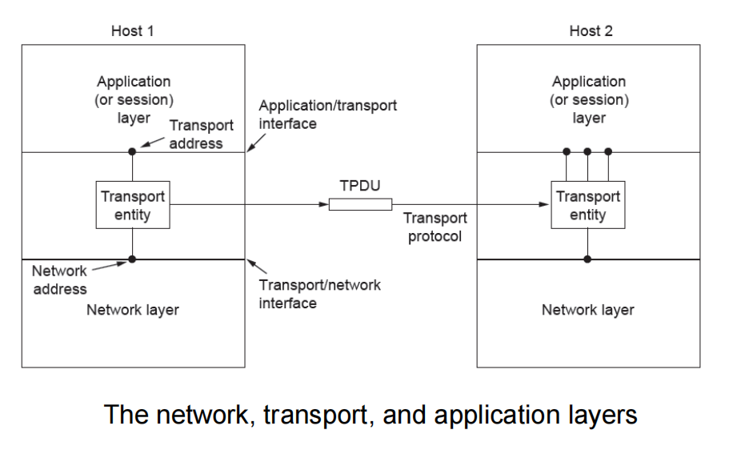
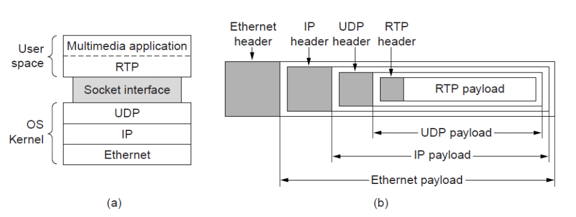

# 传输层
保证数据从源端到目的端的可靠
端到端的服务，应用程序只运行在终端上，不需要位网络设备编写程序(透明性)

## Transport Service
### Upper Layer Services
为应用层服务

传输层为应用层提供多个端口

网络层提供尽力而为
- 最大努力在终端间交付分组，但不提供任何承诺
- 不保证交付、不保证按序交付，不保证数据完整，不保证延迟，不保证带宽等

传输层有所为，有所不为
- 传输层可以通过差错恢复、重排序等手段提供可靠、按序的交付服务
- 但传输层无法提供延迟保证、带宽保证等服务

传输层提供
- UDP协议
  - 支持单播、多播、广播
  - 无连接、不可靠
  - 可以任何速率发送数据
- TCP协议
  - 仅单播
  - 面向连接、可靠按序
  - 流量控制，发送速率不超过接收方的接收能力
  - 拥塞控制，网络过载时限制发送方的发送速率
### Transport Service Primitives
提供类似原语的概念，Socket套接字，应用层和传输层的接口，也是应用程序和网络之间的API，保证应用的简单，拿来就用

|Primitive|Packet sent|Meaning|
|:--:|:--:|:--:|
|LISTEN|(none)|Block until some process tries to connect|
|CONNECT|CONNECTION REQ|Actively attempt to establish a connection|
|SEND|DATA|Send information|
|RECEIVE|(none)|BLock until a DATA packet arrives|
|DISCONNECT|DISCONNECTION REQ|The side wants to release the connection|
### Berkeley Sockets
- SOCKET: 
- BIND
- LISTEN
- ACCEPT
- CONNECT
- SEND
- RECEIVE
- CLOSE

### Example of Socket Programming: Internet File Server

## Elements of Transport Protocols

### Addressing
和物理层的点到点来说都是点到点的抽象，但是传输层的更复杂

SAP(Service Access Poing)服务访问点
- TSAP在应用层和传输层之间，例如端口号
- NSAP在传输层和网络层之间，例如IP地址

比如说一个请求要访问8888端口的进程，那么传输层就告诉这个请求这个进程要往哪里走，不然就要一个个访问浪费时间

### Connection establishment
有很多规范
hop counter in each packet
最早利用本地时钟决定序列号，别人不容易猜到，不会重叠

Three-way handshake in the early days
host1 --> host2: CR(seq=x)连接请求
host1 <-- host2: ACK(seq=y,ACK=x)响应
host1 --> host2: DATA(seq=x,ACK=y)再确认

正是由于网络层IP的不可靠性
但是如果没有第三次握手
- host2不知道host1收没收到，不确定
- host1知道host2没收到，所以也不确定

有幽灵误连接，不买东西来起哄的，服务器也要打招呼，这时候再确认的优越性也体现出来
host1 --> host2: CR(seq=x)old duplicate
host1 <-- host2: ACK(seq=y,ACK=x)响应
host1 --> host2: REJECT(ACK=y)发送拒绝

...

虽然不是百分百，但是尽可能降低

### Connection release
有定时器，lost了就规定时间内没有响应就默认执行，避免半开半闭资源浪费

### Error control and flow control
类似：回退N帧和选择重传都有

方法
- 固定大小buffers
- 链表方式，针对每一个应用分配不同的buffer
- 一个大的循环的buffer per connection

例子也有这种控制流量
接收方明确地告诉发送方已经确认了多少个报文，还有多少个缓冲区

**要考**流量控制：点到点的；拥塞控制：区域的（课本上的观点）
调整**发送方**的速率

### Multiplexing
多个应用程序复用同一个传输层

### Crash recovery
差错控制采用一些不同的策略，但没有一行能够真正的OK，所有都恢复是不可能的，剩下的就交给上一层来处理
- always retransmit
- never retransmit
- retransmit in S0
- retransmit in S1

## Congestion Control
拥塞控制

超过了临界点，网络中流量的输出就下降了

### Desirable bandwidth allocation
最大最小带宽分配？

### Regulation the sending rate
根据接收方的反馈调整
- 接收方比较小，发送方就发少一点
- 接收方比较大，但是网络原因发送方发得比较慢

假设一个主机性能非常优秀，但是也不能保证发送给它的就能很快处理，因此我们时时刻刻就要调整

例如AIMD的control law，我们Additive Increase Multicative Decrease，慢慢减少，一次减少一半

## The Internet Transport Protocols: UDP

### Introduction to UDP
**要考**伪头部只是发送端、接收端检验用的，不会出现在传输过程中

### Remote Procedure Call

### Real-Time Transport
RTP然而**并不是传输层**的东西，通过类似socket的接口和UDP完成

UDP一会快一会慢(延迟和抖动)，因此需要一个缓冲区，我们均匀地取出来

## The Internet Transport Protocols: TCP

### The TCP Service Model
- 20, 21: FTP: file transfer
- 22: SSH: Remote login, replacement for Telnet
- 25: SMTP: Email
- 80: HTTP: World Wide Web
- ...
上面都是应用层的

TCP中默认的粘包功能，如果发一个字节就发一次(20B + 20B，效率太低)，数据少就让别的捎带，但又存在别的问题

MSS最大字节，超过了再发送，保证效率；RTT保证时效

### The TCP Segment Header
Sequence number 依赖本地时钟产生随机数来生成序列号，非常复杂

比较充分和完备，现在甚至还有用不上的保留字段

## Delay Tolerant Networking

## 拥塞控制
先指数增长，然后线性增长，然后减半...

**要考**什么鬼窗口

