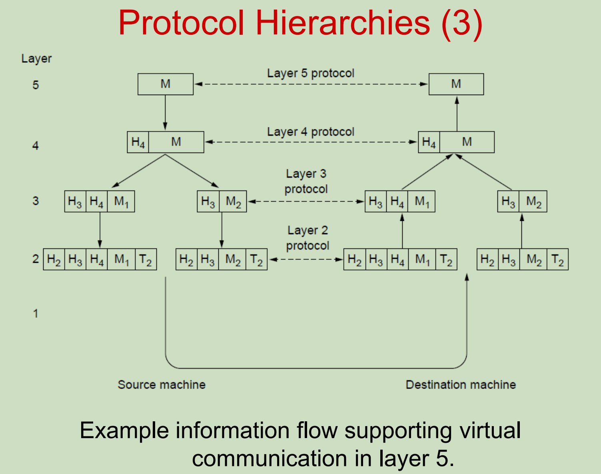
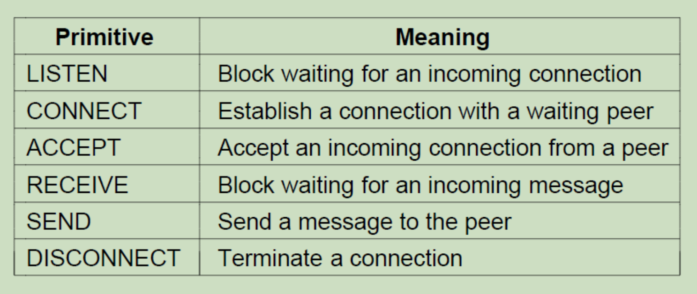
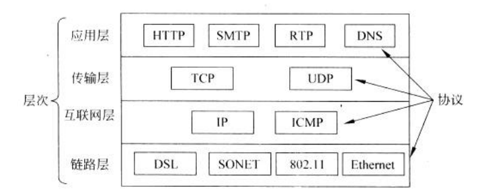

# Overview
## 书本封面
- 物理层
  - 一只鸽子叼着信：无线传输
  - 有线传输
- 传输
  - 堵车：卡了
  - 撞车：数据丢失
- 不同协议加不同gas
- 不同网络传输过程用不同协议
- 三岔路口找路由，数据链路层
## 网络
- OSI网络模型
- 一定要有协议

# INTRODUCTION
## 用途
1. 商业
多个用户端一个服务端

2. 家庭
没有固定的用户端客户端

3. 移动
wireless/mobile True&False 的排列组合

4. 社会
社会问题emm

## 网络分类
课件图片只是参考
背后是协议的差异
了解名词
- PAN(personal area network)
  - 强调低功耗 -> 因此使用的协议不是那么繁琐，比较“简单”
- LAN(local area network)局域网
  - 内部畅通
  - 外部需要考量，一般互不影响
- MAN(metropolitan area network)城域网
- WAN(wide area network)广域网
- Internet互联网

### SDN
software-defined networking
[GFGINFO](https://www.geeksforgeeks.org/software-defined-networking/)

## 网络硬件设备
- PC
  - 网卡
    - 有线
    - 无线
  - 信道
- 交换机Switch/路由器Router 光纤接过来

## 网络软件
### Protocol Hierarchies
- 实体**对等层**的约定或规范的集合称之为**协议**protocol，和别的层无关
  - 分层的好处：如果某一个协议要升级，可以不影响其他的/整个系统，工程上好 耦合性降低
- 层与层之间通过**接口**连接上层通过接口调用底层提供的**服务**，上下层之间的接口要有对应的明确的界定

### 解包和包装
- 拆分信息，固定一个数据包XX字节，解决带宽不足
- 通过添加标签便于接收端区分和拼接(解包)，注意标签也占用字节的
- 不管数据大小，都会经过每个层次的打包，这就是规范
- 协议规定上述种种，协议的效率 = $\frac{数据大小}{数据大小 + 标签大小}$，称数据大小为**净荷**，希望效率越高越好，即`payload >> label`

为什么第一次分开右边的没有H4
要是有H4就违背了分层的原则，下一层没有权利获得H4标签，上层传下来的所有东西(包括标签)都当成数据

第3层分开的两个数据包的传输过程是完全独立的

有的协议里面不仅会加H还会加T，通过尾部和一定数据规则校验，减小噪声干扰

## 通信模型

信道有干扰就存在噪声noise

信道：物理介质

## 连接 connection-oriented versus connectionless

| 比较方面 | 无连接服务 | 面向连接的服务|
| :----: | :----: | :----: |
|连接建立 |	不需要建立连接 | 建立连接，保持连接，释放连接 |
|分组顺序	| 按顺序发送，但未必按顺序接收 | 按序接收 |
|地址信息 |携带完整的目的地址 |	不需要完整目的地址 |
|服务可靠性 | 不可靠服务 | 可靠服务 |
|服务效率	| 协议简单，效率高 | 协议复杂，效率不高 |

**里面的例子**

### connection-oriented
- 面向电话系统建模
- 需要申请管道传输，完了还要释放
- TCP
### connectionless
- 面向邮政系统建模
- packet就带有destination
- UDP

## Service Primitive

### 通讯方式
#### 双工
全双工通信允许数据同时在两个方向上传输，即有两个信道，因此允许同时进行双向传输。
全双工通信是两个单工通信方式的结合，要求收发双方都有独立的接收和发送能力。
全双工通信效率高，控制简单，但造价高。
计算机之间的通信是全双工方式。一般的电话、手机也是全双工的系统,因为在讲话时可以听到对方的声音。
#### 半双工
半双工通信允许信号在两个方向上传输，但某一时刻只允许信号在一个信道上单向传输。
因此，半双工通信实际上是一种可切换方向的单工通信。
此种方式适用于问讯、检索、科学计算等数据通信系统；
传统的对讲机使用的就是半双工通信方式。由于对讲机传送及接收使用相同的频率，不允许同
时进行。因此一方讲完后，需设法告知另一方讲话结束（例如讲完后加上’OVER’），另一方
才知道可以开始讲话。
#### 单工
- 单工通信只支持信号在一个方向上传输（正向或反向），任何时候不能改变信号的传输方向。
- 为保证正确传送数据信号，接收端要对接收的数据进行校验，若校验出错，则通过监控信道发送请求重发的信号。
- 此种方式适用于数据收集系统，如气象数据的收集、电话费的集中计算等。
- 例如计算机和打印机之间的通信是单工模式，因为只有计算机向打印机传输数据，而没有相反方向的数据传输。还有在某些通信信道中，如单工无线发送等。

## 参考模型
### OSI
学院派，没人实现
Minimize information flow across interfaces between boundaries
层与层之间信息交流**参数尽量简化**
[还是看书把34(49/756)](../../%E8%AE%A1%E7%AE%97%E6%9C%BA%E7%BD%91%E7%BB%9C%EF%BC%88%E7%AC%AC%E4%BA%94%E7%89%88%EF%BC%89%EF%BC%88%E7%89%B9%E5%8D%97%E9%B2%8D%E5%A7%86%EF%BC%89.pdf)
虽然实际不用，但是考试会考

| 层 | Name of unit exchanged |
| :--: | :--: |
| 应用层 | APDU |
| 表示层 | PPDU |
| 会话层 | SPDU |
| 传输层 | TPDU/Message(报文) |
| 网络层 | Packet |
| 数据链路层 | Frame |
| 物理层 | Bit |

PDU(Protocol Data Unit)协议数据单元

下面三个都是比较公认的，上面没有统一的说法

**OSI模型的核心**
- 服务
- 接口
- 协议

### TCP/IP
实际的实践的，广泛应用
提出了host-network，对数据链路层的适配(蓝牙、网线、WIFI...)
简化层级
分层也不统一，人们根据现有网络提出的理论
- Link layer
- Internet layer
- Transport layer
  - TCP(Transport Control Protocol)面向连接
  - UDP(User Datagram Protocol)无连接
- Application layer

## 前世今生
ARPANET 最早的雏形，老祖宗

## distributed MST
[csdn](https://blog.csdn.net/m0_52739647/article/details/129717416)